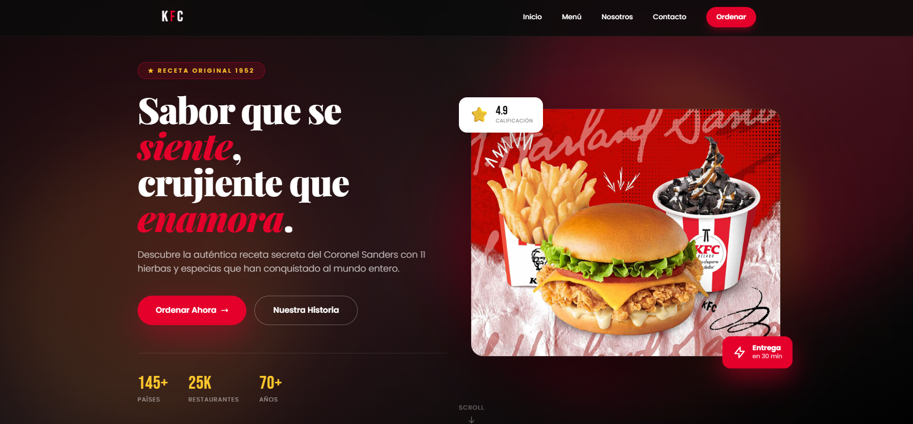

# Concepto de Landing Page para KFC

Este proyecto es un concepto de landing page moderna y visualmente atractiva para KFC, construida con HTML y Tailwind CSS. Muestra una variedad de técnicas de front-end para crear una experiencia de usuario atractiva.

## 📸 Vista Previa



## ✨ Características

- **Diseño Moderno y Responsivo**: Diseño totalmente responsivo que se adapta a diferentes tamaños de pantalla, desde móviles hasta ordenadores de escritorio.
- **Encabezado con Efecto Glassmorphism**: Un encabezado semitransparente y desenfocado que permanece fijo en la parte superior de la página.
- **Animaciones Avanzadas**:
  - Animaciones al hacer scroll (`fade-up`, `fade-right`).
  - Animaciones en bucle para elementos decorativos (`float`, `pulse-glow`, `spin-slow`).
  - Efectos de hover interactivos en enlaces de navegación, botones y tarjetas de productos.
- **Tipografía Personalizada**: Utiliza Google Fonts (`Bebas Neue`, `Playfair Display`, `Poppins`) para una identidad de marca distintiva.
- **Fondos Complejos**: La sección principal presenta degradados en capas, blobs animados y un anillo decorativo giratorio para crear profundidad.
- **Secciones Estructuradas**: La página está bien organizada con secciones claras:
  - **Hero**: Una introducción atractiva con una llamada a la acción.
  - **Menú**: Una cuadrícula de tarjetas de productos con precios y un botón para "agregar".
  - **Sobre Nosotros**: Una sección que detalla la historia de la marca.
  - **Footer**: Contiene enlaces de navegación e información de contacto.

## 🛠️ Tecnologías Utilizadas

- **HTML5**: Para la estructura de la página.
- **[Tailwind CSS](https://tailwindcss.com/)**: Un framework de CSS "utility-first" para un desarrollo rápido de la interfaz de usuario.
- **[Google Fonts](https://fonts.google.com/)**: Para fuentes web personalizadas.
- **JavaScript**: Se utiliza un pequeño script para configurar el tema de Tailwind CSS con colores, fuentes y animaciones personalizadas.

## 📁 Estructura del Proyecto

```
kfc-app/
├── kfc.html        # Página principal del proyecto
├── img/
│   └── image.png   # Vista previa de la landing page
└── README.md
```

## 🚀 Cómo Visualizar

Simplemente abre el archivo `kfc.html` en un navegador web moderno para ver la página en acción.

## 📄 Licencia

Este proyecto tiene fines educativos y de demostración. Todas las marcas y nombres relacionados con KFC pertenecen a sus respectivos propietarios.

